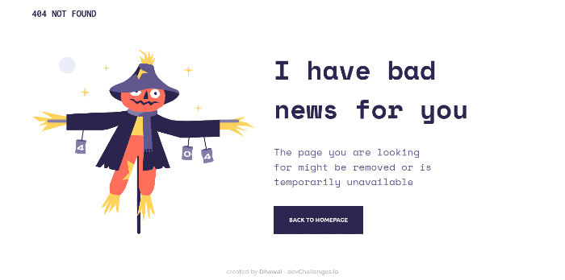

# :star2: devChallenges - 404 Not Found :star2:

Solution for a challenge from  <a href="https://devchallenges.io" target="_blank">Devchallenges.io</a>.  
This application/site was created as a submission to a [DevChallenges](https://devchallenges.io/challenges) challenge. The [challenge](https://devchallenges.io/challenges/wBunSb7FPrIepJZAg0sY) was to build an application to complete the given user stories.

<h3> :point_right:
    <a href="https://404-not-found-challenge-1.netlify.app/">
      Live Site 
    </a>
</h3>

## :camera: Overview

## 💪 Built With

- HTML5 Semantics
- CSS3 (with Grid and Flexbox)
- Media Queries (for Mobile design)

## :man: Author

- devChallenges [@dhawalRath](https://devchallenges.io/portfolio/dhawalRath)
- Twitter [@dhawalRath](https://{twitter.com/dhawalRath})
